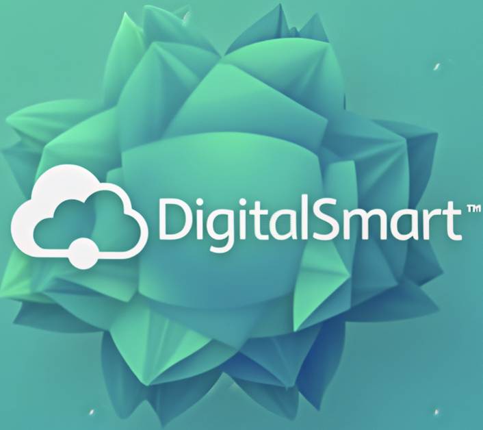

# BoyunCloud云服务平台

--------------------------

<h2 align="center"> 业务驱动 · 技术赋能 | 数字转型 · 智能增效  </h2>
<h4 align="center"> 基于DDD+SpringBoot/SpringCloud搭建的微服务架构解决方案平台 </h4>

--------------------------

    
    
    
    
    
    

--------------------------

## 项目介绍

## 核心特性

## 系统架构

## 功能描述

## 技术架构

- **后端框架**：[Spring Boot](https://spring.io/projects/spring-boot/) 、[Spring Security](https://spring.io/projects/spring-security/)
- **前端框架**：[React.js](https://react.dev/) 、[Ant Design](https://ant.design)
- **中间件**：[MySQL](https://www.mysql.com/) 、[Redis](https://redis.io/)
- **基础设施**：[Docker](https://www.docker.com/) 、[Nginx](https://nginx.org/) 

## 项目结构

## 安装部署

